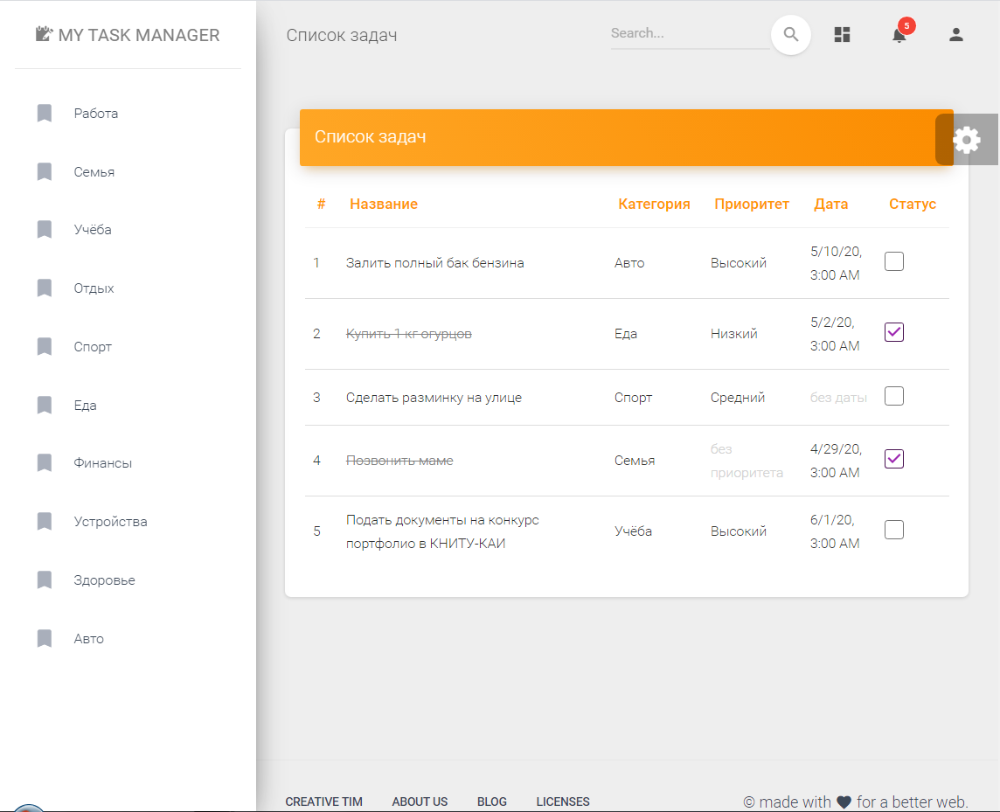

# My task manager 📝
Планировщик задач на TypeScript с ипользованием фреймворка Angular

### Возможности
- Отображение всех задач при загрузке приложения.
- Отображение задач из категории - при выборе категории.
- Выполненные задачи зачеркиваются. Для этого их нужно отметить галочкой в столбце "Выполнено".
- Загрузка данных (задач, категорий) происходит из тестового файла в директории проекта.

